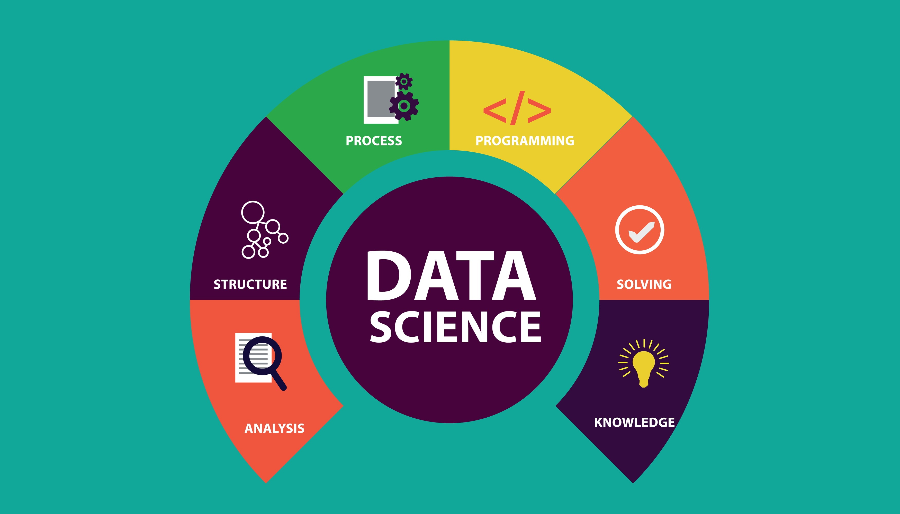

🏛️ Painel de Inteligência: Transparência e Ouvidoria (CGU)
Ciência de Dados e IA a serviço da Governança Digital e Cidadania.

Este projeto apresenta um sistema de Governança Digital e Análise Preditiva aplicado aos dados de transparência passiva e ouvidoria da Controladoria-Geral da União (CGU). Desenvolvido como parte do Mestrado em Informática Aplicada (UFRPE).

🎯 Objetivo
Monitorar a saúde da relação entre Estado e Cidadão, integrando dados de Transparência Passiva (LAI) e Manifestações de Ouvidoria. O painel utiliza Machine Learning para identificar gargalos, prever riscos de atraso (SLA) e analisar a satisfação do cidadão de forma proativa.

📊 Visões do Painel e Funcionalidades
1. Visão Estratégica e Monitoramento
Dashboards Interativos: Monitoramento de volume de demandas (LAI vs Ouvidoria) com série temporal comparativa.

Eficiência LAI: Análise de pedidos negados vs concedidos e ranking de órgãos mais demandados.

Inteligência Social: Perfil demográfico do cidadão (Gênero, Raça, Faixa Etária) e principais assuntos reclamados.

ETL Robusto: Processamento escalável de grandes volumes de dados (7M+ registros) utilizando Parquet.

2. Laboratório de IA & NLP
Simulador de Risco: Classificação em tempo real de manifestações com probabilidade de atraso (SLA).

Explicabilidade Global e Local (SHAP): Visualização dos termos técnicos que mais influenciam as decisões do modelo de IA.

Estimativa de Satisfação: Algoritmo de análise de sentimento para mensurar a resolutividade sob a ótica do cidadão.

Shutterstock
Explorar
🛠️ Tecnologias
Linguagem: Python 3.12

Interface e Gráficos: Dash & Plotly

Machine Learning: Scikit-Learn (Random Forest), Imbalanced-learn (SMOTE)

NLP: TF-IDF com filtragem customizada de ruídos gramaticais e Regex.

Interpretabilidade: SHAP (Lundberg, 2017).

Armazenamento: PyArrow (Parquet)

📂 Estrutura do Projeto
Plaintext
├── data/
│   ├── raw/             # Dados brutos (Ignorado no Git)
│   └── processed/       # Parquets otimizados e Modelos (.pkl)
├── pages/               # Módulos das visões do Dashboard
├── scripts/             # Pipelines de ETL e Treino da IA
├── app.py               # Arquivo principal (Execução)
└── requirements.txt     # Dependências do sistema
🚀 Como Executar
Instale as dependências:

Bash
pip install -r requirements.txt
Execute o dashboard:

Bash
python app.py
Acesse no navegador: http://127.0.0.1:8050